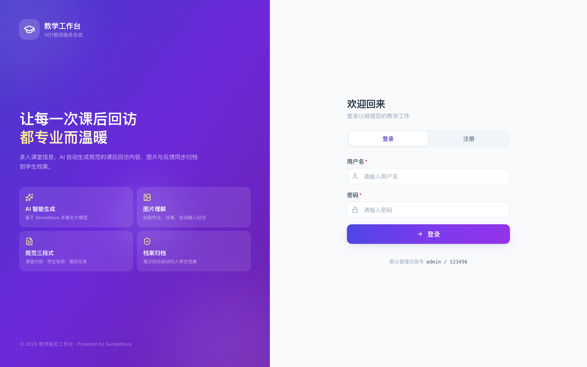
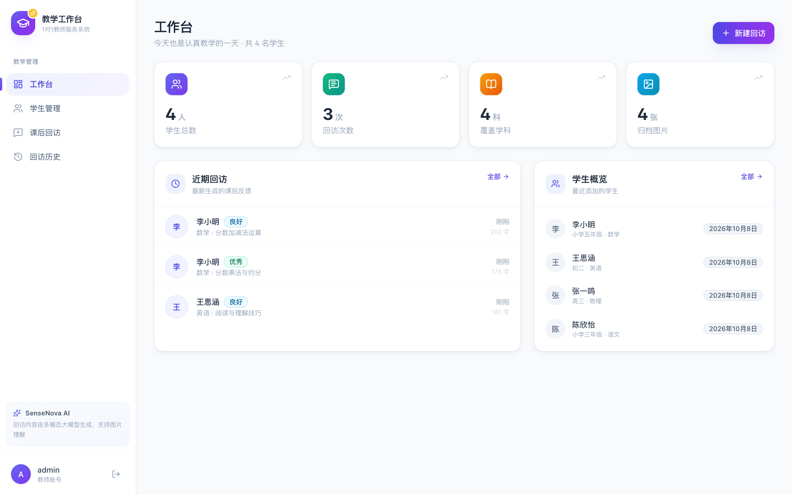
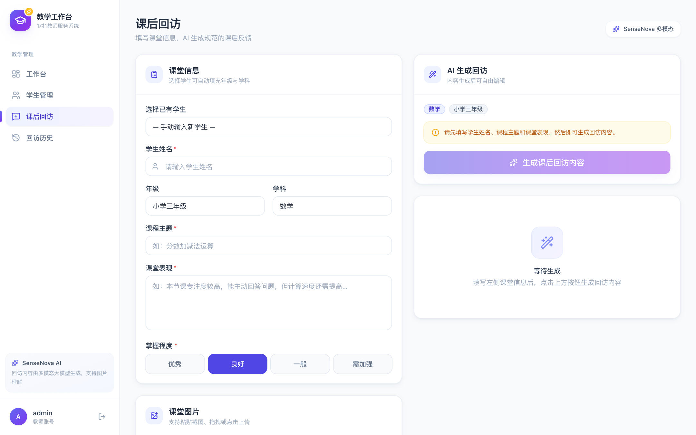
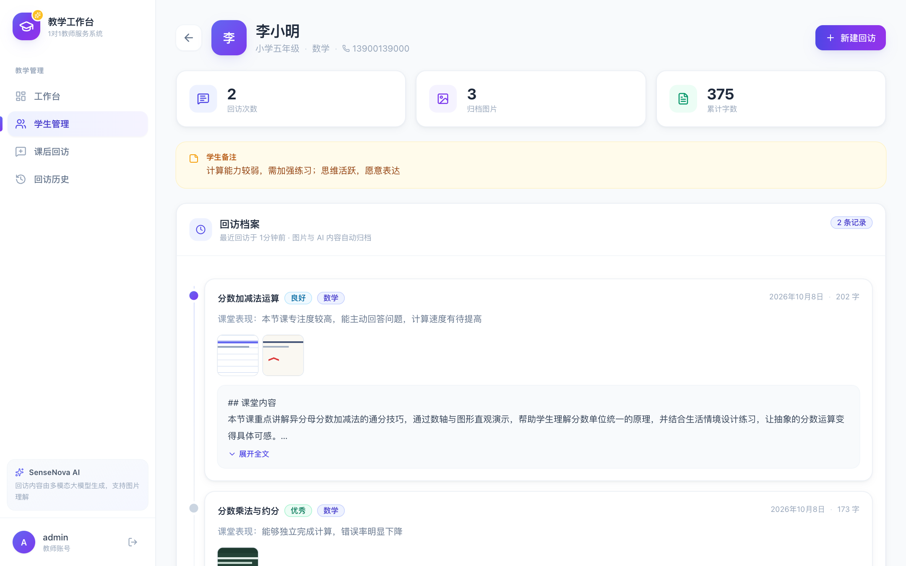

# 1对1老师教学服务工作台

一个面向1对1教师的教育服务管理平台，支持学生信息管理、课后回访AI生成等功能。

## 功能特性

### 1. 用户认证
- 注册/登录系统，JWT Token 鉴权
- 默认管理员账号: admin / 123456

### 2. 学生管理系统
- 学生信息增删改查、按姓名/年级/学科搜索
- 字段：姓名、年级、学科、联系电话、备注

### 3. 课后回访模块（核心）
- 课堂信息录入：学生姓名、年级、学科、课程主题、课堂表现、掌握程度
- 图片上传：支持 Ctrl+V 粘贴截图 / 文件选择上传 / 拖拽上传
- AI 智能生成：接入商汤 SenseNova 多模态大模型
- 输出规范：课堂内容、学生收获、课后任务 三段，150-500字
- **流式输出**：文字实时逐字出现，生成过程可见，可随时取消
- 生成过程显示实时耗时，避免误以为卡死
- 生成失败按原因给出明确提示（Key 无效 / 超时 / 限流 / 网络）
- 已保存的回访支持**再次编辑**（主题、表现、掌握程度、内容）
- 一键复制回访内容，可直接粘贴到微信发给家长
- 历史记录按学科/年级筛选，**服务端分页**（每页 20 条）
- **档案导出**：按学生导出 Markdown（可读可粘贴）或 CSV（Excel/WPS 可打开），支持日期区间

### 4. 工作台仪表盘
- 学生总数、回访总数、覆盖学科、归档图片统计
- 近期回访动态、学生概览

### 5. 界面设计
- shadcn/ui 风格的设计令牌体系（颜色 / 阴影 / 圆角 / 动效）
- lucide-react 图标 + framer-motion 微动效
- 完整组件原语：Button / Card / Badge / Modal / Toast / Skeleton / EmptyState
- 骨架屏、空状态、轻量通知，替换原生 alert

## 界面预览

| 登录页 | 工作台 |
|:---:|:---:|
|  |  |

| 课后回访 | 学生档案 |
|:---:|:---:|
|  |  |

## 技术栈

| 层级 | 技术 |
|------|------|
| 前端 | React 18 + Vite + TypeScript + TailwindCSS |
| 后端 | Node.js + Express + TypeScript |
| 数据库 | SQLite (better-sqlite3) |
| AI | SenseNova sensenova-6.8-flash-lite (OpenAI兼容) |
| 部署 | Docker + Docker Compose + Lucky (反代/证书) |
| UI | TailwindCSS + lucide-react + framer-motion |
| CI/CD | GitHub Actions + GHCR |

## 项目结构

```
teaching-workbench/
├── server/                        # 后端服务
│   ├── Dockerfile                 # 后端 Docker 配置（多阶段构建）
│   ├── .dockerignore
│   ├── src/
│   │   ├── config/                # 数据库、环境配置
│   │   ├── middleware/            # 认证、错误处理
│   │   ├── routes/                # 认证、学生、回访、上传
│   │   ├── services/              # SenseNova AI 集成
│   │   └── index.ts               # 主入口（含 /health 端点）
│   └── .env                       # 环境配置
├── web/                           # 前端应用
│   ├── Dockerfile                 # 前端 Docker 配置（多阶段构建+nginx）
│   ├── nginx.conf                 # nginx 配置（反向代理API）
│   ├── .dockerignore
│   └── src/
│       ├── api/                   # API 客户端
│       ├── components/            # 公共组件
│       ├── context/               # 认证上下文
│       ├── pages/                 # 登录、工作台、学生、回访
│       └── types/                 # 类型定义
├── .github/workflows/
│   └── docker-publish.yml         # GitHub Actions CI/CD
├── docker-compose.yml             # Docker 编排
├── deploy.sh                      # NAS 一键部署脚本
├── backup.sh                      # 数据备份脚本
├── .env.production.example        # 生产环境变量模板
└── README.md
```

## 本地开发

### 环境要求
- Node.js 18+

### 配置 AI API Key

```bash
cd server
cp .env .env
# 编辑 .env，填入 SENSENOVA_API_KEY
```

### 启动服务

```bash
# 后端
cd server && npm install && npm run dev
# 前端
cd web && npm install && npm run dev
```

访问 http://localhost:5173 ，默认账号 admin / 123456

## NAS Docker 部署

### 前置条件
- NAS 上已安装 Docker + Docker Compose
- NAS 已配置域名并解析到公网IP
- GitHub 仓库已配置（代码已推送）

### 部署步骤

#### 1. 克隆代码到 NAS

```bash
git clone https://github.com/je668/teaching-workbench.git
cd teaching-workbench
```

#### 2. 配置环境变量（API Key 写这里）

> **重要：API Key 写进 `.env`，不要写进 `docker-compose.yml`。**
> `docker-compose.yml` 会提交到 GitHub，而 `.env` 已在 `.gitignore` 中排除，密钥不会泄露。
> `docker-compose.yml` 里的 `${SENSENOVA_API_KEY}` 会自动从同目录的 `.env` 读取。

```bash
cp .env.production.example .env

# 编辑 .env 文件：
# - JWT_SECRET: 可留空（自动生成并持久化）；如需自管则 openssl rand -hex 32
# - SENSENOVA_API_KEY: 填入你的 SenseNova API Key（sk- 开头）
# - CORS_ORIGINS: 可留空（同源访问无需 CORS）；仅分域部署时才填
# - FRONTEND_PORT: 默认 80，不想占用 80 就改成如 10880
# - DEFAULT_ADMIN_PASS: 修改默认密码
```

**飞牛 NAS 用户**：飞牛的 Docker Compose 界面支持直接粘贴 `docker-compose.yml`。有两种方式放密钥：

- **方式 A（推荐）**：在 compose 文件同目录新建 `.env` 文件，内容同上，Compose 会自动加载。
- **方式 B**：用飞牛界面的「环境变量」配置项，逐个添加 `JWT_SECRET`、`SENSENOVA_API_KEY` 等键值对，效果等同。

#### 3. 首次部署

```bash
# 拉取镜像并启动
./deploy.sh

# 或手动执行:
docker compose pull
docker compose up -d
```

#### 4. Lucky 反向代理配置

在 NAS 的 Lucky 中创建反向代理规则：

| 配置项 | 值 |
|--------|-----|
| 名称 | 教学工作台 |
| 域名 | your-domain.com |
| 上游地址 | 见下方说明 |
| 证书 | 自动申请 Let's Encrypt |
| 传输 | HTTPS |

**上游地址取决于 Lucky 的部署方式：**

| Lucky 部署方式 | 上游地址 |
|---|---|
| Lucky 装在宿主机（非容器） | `http://127.0.0.1:10880` （= 你在 .env 里设的 FRONTEND_PORT） |
| Lucky 也在 Docker 且与本项目同一网络 | `http://teaching-workbench-frontend:80` |

> 容器内 nginx 固定监听 80，只改宿主机映射端口。

> Lucky 负责 SSL 证书申请和续期，前端 nginx 接收 80 端口请求后自动代理 /api 到后端。

#### 5. 日常更新

```bash
# 拉取最新镜像并重启
./deploy.sh

# 部署前自动备份
./deploy.sh --backup

# 回滚到上一个版本
./deploy.sh --rollback
```

#### 6. 数据备份

```bash
# 手动备份
./backup.sh

# 建议添加定时任务（每天凌晨3点）
crontab -e
# 添加: 0 3 * * * /path/to/teaching-workbench/backup.sh
```

### GitHub Actions 自动构建

代码推送到 main 分支后，GitHub Actions 会自动：
1. 构建后端 Docker 镜像 → 推送到 GHCR
2. 构建前端 Docker 镜像 → 推送到 GHCR
3. 使用 git SHA 和 latest 双标签，支持精确回滚

镜像地址:
- 后端: ghcr.io/je668/teaching-workbench-backend:latest
- 前端: ghcr.io/je668/teaching-workbench-frontend:latest

### 生产架构

```
Internet → 域名 → Lucky (反代+SSL)
                    ↓
              frontend:80 (nginx)
                    ↓
              ┌─────┴─────┐
              │ 静态文件    │ /api/* → backend:3000
              │ React Build│
              └───────────┘
                    
              backend:3000 (Express)
              ├─ /health (健康检查)
              ├─ /api/* (API)
              └─ /uploads/* (图片)
                    
              Volume: db_data
              ├─ teaching.db (SQLite)
              └─ uploads/ (图片)
```

### 备份说明

- 数据库: 每日备份 teaching.db
- 上传文件: 每日备份 uploads/ 目录
- 保留策略: 自动保留最近 7 天备份
- 备份位置: ~/backups/teaching-workbench/

## 测试

三层测试，全部接入 CI：

| 层级 | 技术 | 用例数 | 命令 |
|------|------|--------|------|
| 后端 | Node 内置 test runner + 原生 fetch（零额外依赖） | 80 | `cd server && npm test` |
| 前端 | Vitest + Testing Library + jsdom | 104 | `cd web && npm test` |
| 端到端 | Playwright（复用系统 Chrome） | 14 | `cd web && npm run e2e:full` |

> CI 顺序：后端测试 + 前端测试 → E2E → 构建镜像。
> **任一环节失败都不会发布镜像。**

### 后端测试覆盖

| 领域 | 用例要点 |
|------|----------|
| 认证 | 注册/登录/鉴权/伪造 token/重复用户名 |
| 限流 | 超阈值返回 429 与 Retry-After |
| 学生 | CRUD、搜索、档案统计、跨用户数据隔离 |
| 回访 | CRUD、字数计算、关联越权防护、筛选、分页 |
| **分页稳定性** | 同秒批量写入后翻页不重复、不漏项 |
| CORS | 未知来源不报错且不下发 CORS 头 |
| 上传 | 类型校验、路径前缀、可访问性、路径穿越防护 |
| AI 生成 | 缺参校验、成功路径、错误分类映射（注入桩，不打真实 API） |
| 流式 | SSE 事件序列、字数重试、错误事件、缓冲头 |

> 测试通过 `DATA_DIR` 使用独立临时目录与数据库，不会污染开发数据。

### 前端测试覆盖

| 模块 | 用例要点 |
|------|----------|
| `lib/utils` | 字数口径、日期格式化、相对时间、剪贴板回退 |
| `context/AuthContext` | **首帧即恢复登录态**（深链接回归）、脏数据容错、登出清理 |
| `api/client` | SSE 解析：分片边界、分隔符被切开、多事件同片、坏 JSON 容错、中断检测、AbortSignal |
| UI 组件 | Button / Badge / Field / Modal / ConfirmDialog / EmptyState / Toast |
| **登录页** | 登录调用、失败提示、注册两次密码不一致 / 密码过短拦截、切换模式清空错误 |
| **工作台** | 统计取自 `/followups/stats`（非列表长度）、学科去重、空状态、接口异常不白屏 |
| **学生管理** | 骨架屏、列表渲染、防抖搜索、新增/编辑弹窗预填、删除二次确认、失败 Toast |
| **回访历史** | 列表与字数着色、筛选带参并重置页码、分页边界禁用、详情、编辑校验、删除确认、复制 |
| **学生档案** | 时间线渲染、展开/收起、档案不存在兜底、导出弹窗（格式切换 + 日期区间 + 失败提示） |

### 端到端测试覆盖

| 场景 | 说明 |
|------|------|
| 登录/登出 | 正确凭据、错误提示、未登录跳转、登出清理 |
| **深链接回归** | 已登录时直接访问子页面不被重定向；刷新保持当前页 |
| **真流式生成** | 采样文本长度，断言分多段逐步出现（非一次性） |
| 复制 | 校验剪贴板内容与 Toast 反馈 |
| 保存归档 | 生成 → 保存 → 自动跳转学生档案并可见 |
| 编辑 | 历史页编辑弹窗改内容并生效 |
| 分页 | 造 25 条记录后翻页 |
| 导出 | 下载 Markdown / CSV 并校验文件内容 |

> E2E 通过 `e2e/mock-sensenova.cjs` 模拟 SenseNova（实现 OpenAI 流式协议），
> 在不消耗额度、不依赖外网的前提下跑通
> **SDK 解析 → 后端 SSE → 代理 → 浏览器渲染** 完整链路。
>
> 浏览器复用系统 Chrome（`channel: 'chrome'`），无需下载 Playwright 自带浏览器。

## 安全说明

| 措施 | 说明 |
|------|------|
| 密码哈希 | bcrypt (cost 10) 加盐存储 |
| 鉴权 | JWT Token，默认 7 天有效期 |
| 登录限流 | 同 IP 15 分钟内最多 20 次尝试，防暴力破解 |
| 越权防护 | 所有查询按 user_id 隔离；关联学生时校验归属 |
| 路径穿越防护 | 图片读取限定在上传目录内 |
| 上传校验 | 仅允许 JPG/PNG/WebP，单张最大 10MB |
| 密钥隔离 | API Key 只存在 `.env`，不进入镜像与仓库 |
| 生产提示 | 默认账号提示仅在开发环境显示 |

### JWT 密钥说明

`JWT_SECRET` 用于签发登录令牌。**一旦泄露，任何人都能伪造登录身份。**

本项目做了三层保护，不会退回源码中公开的默认值：

1. 后端启动时若未检测到 `JWT_SECRET`，会**自动生成 64 位强随机密钥**并持久化到 `data/.jwt_secret`（权限 600），重启与镜像更新后自动复用；
2. `deploy.sh` 会在部署前检查 `.env`，为空时自动生成并写入；
3. 若显式配置了 `JWT_SECRET`，则优先使用你的配置（便于备份迁移）。

> **所以：留空也能安全运行。** 若希望自行管理，执行 `openssl rand -hex 32` 生成后填入 `.env`。
>
> ⚠️ 无论哪种方式，首次部署后请立即修改 `DEFAULT_ADMIN_PASS`。

## AI 生成说明

### 输出格式

模型被要求严格输出三段，段标题使用中文方括号（**不用 Markdown 的 # 号**），
因为老师会直接复制这段内容发到微信给家长：

```
【课堂内容】
本节课围绕异分母分数加减法展开……

【学生收获】
小明本节课专注度较高……

【课后任务】
完成练习册第12页第1-8题……
```

prompt 中明确写入了"使用场景"——告知模型内容将被直接发给家长，
因此禁止 Markdown 标记、代码块、前后缀说明。

### 字数控制

要求总字数 150–500 字（不含标点与空格）。
若首轮不达标，会自动追加纠偏指令**重试一次**；仍不达标则返回更接近区间的一版，
前端给出提示并允许保存。

### 思考强度

通过 `SENSENOVA_REASONING_EFFORT` 调节（`none` / `low` / `medium` / `high` / `max`），默认 `low`：

| 取值 | 特点 |
|------|------|
| `none` | 最快最省，但对"三段结构 + 字数区间"的遵循度偏弱，易触发重试 |
| `low` | **默认**，速度与遵循度较平衡 |
| `medium` / `high` | 更稳，但更慢、更耗 token |

### 图片理解

图片以 Base64 Data URL 传入，prompt 要求模型**先观察再写**：
识别题目类型、作答情况、出错位置、书写规范程度、批改痕迹，
并在反馈中体现具体细节（如"第3题通分时漏乘分子"），而非笼统描述。

同时加入防幻觉约束：若图片与课程主题无关或无法辨识，以文字信息为准，不得编造。

## SenseNova API 说明

- Base URL: https://token.sensenova.cn/v1
- Model: sensenova-6.8-flash-lite
- 图片输入: 支持 Base64 Data URL
- 图片格式: JPG、PNG、WebP
- API Key 获取: https://platform.sensenova.cn
